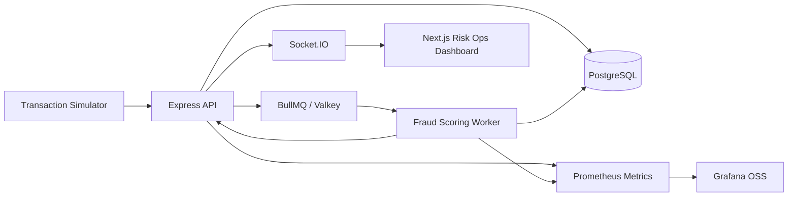

# FraudPulse

FraudPulse is a fully local, open-source real-time fraud detection system. It simulates card transactions, streams them through PostgreSQL event records and a Valkey-backed BullMQ scoring queue, produces explainable fraud alerts, and shows risk operations teams a live dashboard.

## Stack

- Frontend: Next.js, React, TypeScript, Recharts, Socket.IO client
- API: Node.js, Express, TypeScript, Socket.IO, PostgreSQL
- Worker: BullMQ, Valkey, explainable rule/statistical scoring
- Database: PostgreSQL migrations and demo seed data
- Monitoring: Prometheus and Grafana OSS
- Tests: Vitest, Supertest, Playwright

## Run Locally

```bash
cp .env.example .env
docker compose up --build
```

Open:

- Dashboard: http://localhost:13000
- API health: http://localhost:14000/health
- PostgreSQL: localhost:15432
- Prometheus: http://localhost:19090
- Grafana: http://localhost:13001, login `admin` / `fraudpulse`

The simulator starts automatically in Docker Compose. Change `SIMULATOR_TPS` to control transaction volume.

The dashboard also includes scenario replay buttons for:

- Card testing burst
- Impossible travel
- Account takeover

Each scenario writes real transactions, queues scoring jobs, and creates alerts through the same pipeline as the background simulator.

## Local Development

```bash
npm install
npm run dev:api
npm run dev:worker
npm run dev:simulator
npm run dev:web
```

Run tests:

```bash
npm test
```

Run the recalibration script:

```bash
npm run recalibrate
```

## Local Security Model

FraudPulse ships with local demo API tokens so the full stack remains free, open-source, and one-command runnable. Health and Prometheus metrics are public for container checks; operational API routes require `x-api-token` or `Authorization: Bearer ...`.

Default roles:

- `local-viewer-token`: read-only dashboard access
- `local-analyst-token`: case review, exports, notes, bulk decisions
- `local-admin-token`: rule tuning, simulator controls, model recalibration, security console
- `local-service-token`: simulator transaction ingestion and worker broadcasts

Change `API_TOKENS`, `NEXT_PUBLIC_API_TOKEN`, and `API_SERVICE_TOKEN` in `.env` for a real local deployment. The Security page shows the current session, rate-limit buckets, audit activity, and protected report exports.

## Architecture



## Event Pipeline

1. `transaction_created`: API validates and stores a generated or submitted transaction, writes an event row, and enqueues scoring.
2. `transaction_scored`: worker evaluates velocity, amount anomaly, geo-distance, merchant risk, and user history, then stores a fraud score.
3. `fraud_alert_created`: worker creates an alert for high-risk scores and broadcasts the event through the API WebSocket bridge.

Failed scoring jobs retry three times and then move to BullMQ failed jobs while a `transaction_events` dead-letter record captures the payload and error.

## Case Management

Alerts support owner assignment, priority, SLA due time, analyst notes, review decisions, and audit timeline events. This keeps explainability, workflow state, and human feedback tied to the same alert record.

## Fraud Ring Detection

The Ring Graph page detects connected suspicious entities from recent scored transactions. It links users, cards, devices, IP addresses, and merchants, then groups them into risk-ranked clusters that highlight shared devices, shared IPs, merchant convergence, and high transaction concentration.

## Feature Store and Rule Tuning

The worker writes a feature snapshot for every scored transaction, including velocity windows, amount z-score, geo-speed, merchant risk, and device familiarity. The Feature Store page surfaces recent anomalies, while the Rules page can preview how proposed rule weights would change alert volume and model metrics before applying a change.

## Analyst Operations

The Operations page tracks SLA breaches, due-soon work, unassigned cases, analyst workload, saved alert queues, and dead-letter scoring failures. Team leads can bulk-assign alerts and replay dead-letter events back into the scoring queue.

## Hybrid ML-Style Scoring and Drift

FraudPulse blends the rule score with a local logistic-style model score computed from stored features. The model dashboard shows rule score, ML score, blended score, model probability, drift against the recent baseline, and high-disagreement transactions. Recalibration creates a new active local model version without calling any external service.

## Production Hardening

Round 5 adds token-based roles, role-gated mutation routes, per-token rate limiting, audit inspection, protected CSV/JSON report exports, Socket.IO auth, and E2E/API tests for the hardened surfaces.

## Real Trained Local Model

Round 6 adds a real local training path. FraudPulse trains a logistic regression model from labeled feature-store history, including synthetic ground truth and analyst review overrides. The trained model writes learned coefficients, normalization statistics, validation metrics, and training sample counts into `model_versions`, then the scoring worker loads the active model for real-time inference. The rules engine remains in the blend for explainability and operational control.

Train from the CLI:

```bash
npm run train:model
```

Or use the Model Metrics dashboard button to train from the running Docker app.

## Model Explainability

Round 7 adds trained-model feature contribution explanations. Each ML-driven alert records the model kind, probability, linear score, rule/blended score, and the top feature contributions that raised or lowered risk. Alert details show these contributions for case review, and the model dashboard aggregates the strongest feature drivers from recent alerts.

## Model Registry

Round 8 adds champion/challenger model governance. The Model Registry page lists all local model versions, identifies the active champion, recommends an inactive challenger, runs shadow scoring against recent feature-store rows, and allows admin promotion or rollback without deleting model history.

## Entity Risk Memory

Round 9 adds rolling risk memory for users, cards, merchants, devices, and IP addresses. The scoring worker updates `entity_risk_memory` after each scored transaction, blending alert score, velocity, anomaly strength, merchant risk, and recent evidence. The Risk Memory page surfaces the highest-risk entities and user/merchant profiles include persisted memory risk.

## Case Investigation Workspace

Round 10 upgrades alert detail into a full case investigation workspace. The API builds a single evidence bundle containing the alert, transaction, feature snapshot, entity memory, related user/card/device/IP activity, merchant alert pattern, timeline, and recommended analyst actions. Analysts can save point-in-time evidence snapshots for auditability before final review.

## Data Quality and Drift Alerts

Round 11 adds data quality monitoring for the local event and feature pipeline. FraudPulse checks unscored transactions, invalid values, missing entity links, feature-store gaps, orphan events, dead-letter events, delayed scoring, ingestion freshness, scoring lag, and feature drift. Operators can run checks from the Data Quality page, persist quality runs, and track open drift/quality alerts.

## Round Roadmap

Completed:

- Round 1: Fraud ring detection and graph view
- Round 2: Feature store and rule impact preview
- Round 3: Analyst operations workflows
- Round 4: Hybrid ML scoring, drift monitoring, and recalibration controls
- Round 5: Production hardening with auth, security, reports, and E2E tests
- Round 6: Real trained local fraud model
- Round 7: Model explainability with per-feature trained-model contributions
- Round 8: Model registry with champion/challenger promotion and rollback
- Round 9: Entity risk memory for users, cards, devices, IPs, and merchants
- Round 10: Case investigation workspace with evidence bundles
- Round 11: Data quality checks and drift alerting

Remaining:

- Round 12: Advanced simulation lab for configurable fraud campaigns
- Round 13: Real model benchmarking across multiple local algorithms
- Round 14: Security hardening V2 with login, sessions, and key rotation
- Round 15: Deployment polish with CI, screenshots, and demo walkthrough

## Documentation

- API documentation: [docs/api.md](docs/api.md)
- Case study: [docs/case-study.md](docs/case-study.md)
- SQL schema: [infra/db/migrations/001_init.sql](infra/db/migrations/001_init.sql)
- Grafana dashboard: [infra/grafana/dashboards/fraudpulse.json](infra/grafana/dashboards/fraudpulse.json)
